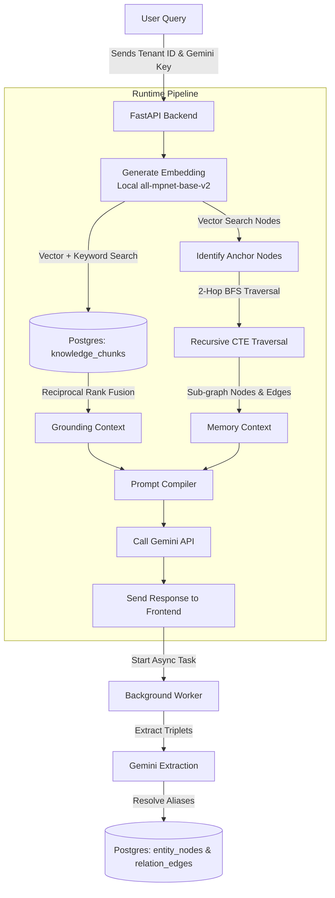
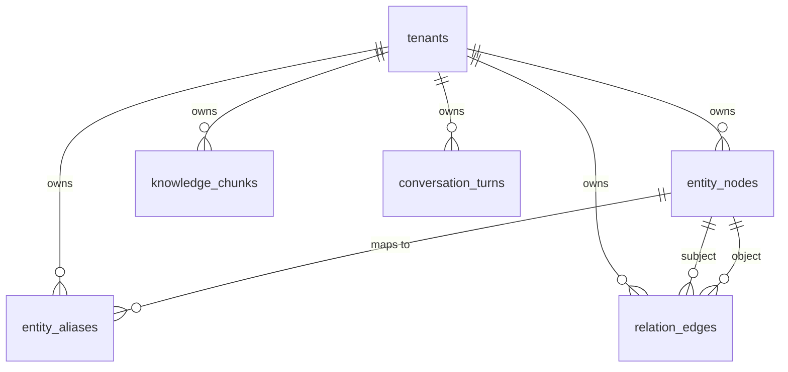
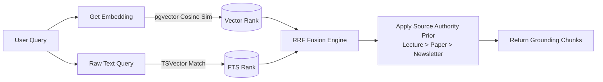
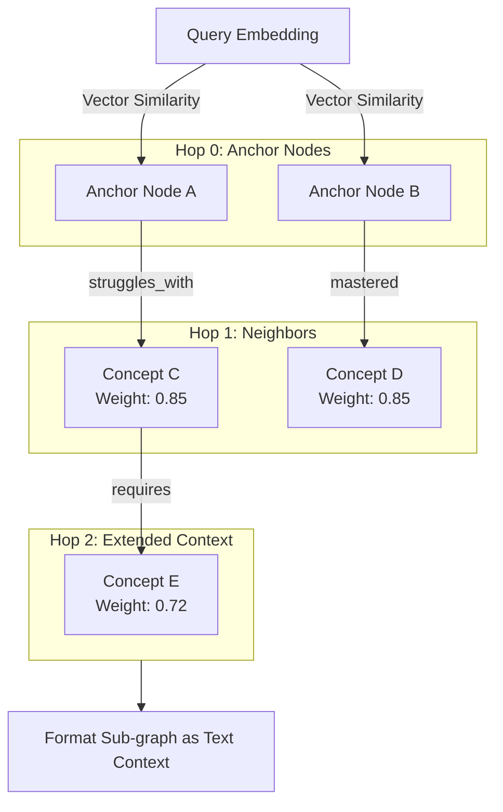
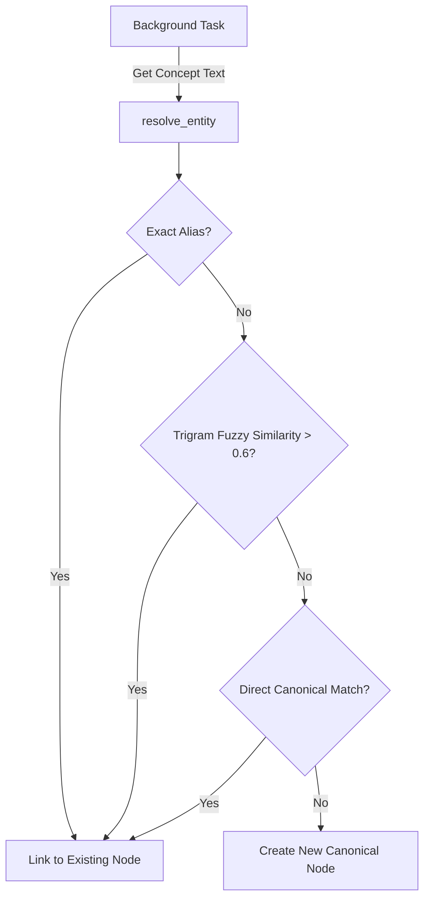

# Technical Architecture: Andrew Ng Digital Twin

I built this project to act as a digital twin of Andrew Ng, teaching machine learning concepts using CS229 notes and DeepLearning.ai materials. Instead of building a generic RAG chatbot, I wanted a system that actually tracks a dynamic memory graph of the student as we chat, identifying their focus areas, struggles, and progress.

---

## 1. System Design and Choices

When designing this, I focused on five main requirements:
*   **Persona consistency:** The prompts force the LLM to use Andrew's actual teaching style (using examples before definitions, concrete physical analogies, and practical, encouraging language).
*   **Fact grounding:** Every response is grounded in lecture notes and transcripts, not the general knowledge of the model.
*   **Dynamic memory:** Instead of using static text files or dumping raw chat history into the context, the system maps out relationships (like concepts the student understands or struggles with) in a database graph.
*   **Hybrid search:** I combined vector search and traditional keyword search inside a single database function using Reciprocal Rank Fusion (RRF).
*   **No startup lag:** The first query was originally timing out because the embedding model loaded lazily. I fixed this by preloading the model into memory during the FastAPI server startup.

---

## 2. Core Components and Flow

Here is how a message travels from the browser, through the search and generation pipelines, and updates the memory graph in the background:

---

## 3. Database Schema

I chose PostgreSQL with the pgvector extension as my only data store. I wanted to avoid the complexity of running separate database engines for vector search and structured relational tables.

### Table Breakdown
*   **tenants:** The root of the session. The frontend generates a new UUID for the tenant on every page load to prevent different sessions from seeing stale memory. If you click "Reset learning memory", it deletes the tenant, and Postgres automatically wipes out all related data via cascade deletions.
*   **entity_nodes:** Stores concepts, people, projects, and papers. Includes a 768-dimensional embedding of the concept name to allow vector matching.
*   **entity_aliases:** Used for entity resolution. Maps short forms or alternate spellings (like "NNs" or "backprop") to their canonical concepts.
*   **relation_edges:** Links concepts together (like "Student struggles_with Gradient Descent") along with numeric weights.
*   **knowledge_chunks:** Holds the raw text of lecture notes, newsletters, and transcripts, combined with vector embeddings and full-text search documents.
*   **conversation_turns:** Logs the dialogue history.

---

## 4. Dual-Path Retrieval and Reciprocal Rank Fusion (RRF)

Instead of using standard vector search alone, which can easily miss exact technical keywords like "sigmoid" or "LSTMs", I built a hybrid search inside a database function called `hybrid_chunk_retrieval`. 

It runs two parallel searches:
1.  **Vector Search:** Finds chunks using cosine distance on the embeddings.
2.  **Keyword Search:** Uses native PostgreSQL full-text search with a fallback query structure.

Since vector scores and keyword matches use different scales, I merge their rankings using Reciprocal Rank Fusion:

$$RRF(d) = \frac{0.65}{60 + Rank_{vec}(d)} + \frac{0.35}{60 + Rank_{fts}(d)}$$

I multiply the resulting score by an *authority prior* based on the source document type. Stanford lecture notes get a 1.0 multiplier, papers get 0.8, QA documents get 0.6, and newsletters get 0.5. This ensures official teaching materials are ranked higher than quick newsletter summaries.

---

## 5. Knowledge Graph Memory Traversal

When the user asks a question, the backend retrieves a relevant sub-graph of their learning history using a Postgres function called `vector_anchored_subgraph`:

1.  **Find Anchors:** The system runs a vector search on `entity_nodes` to find the concepts closest to the user's query.
2.  **BFS Traversal:** Using a recursive Common Table Expression (CTE), it performs a 2-hop traversal along the `relation_edges` starting from those anchor nodes.
3.  **Path Weight Decay:** The weight of relationships decays by 0.85 with each hop, and a visited-array prevents loops.
4.  **Prompt Format:** The retrieved nodes and edges are written into the prompt context so Gemini knows what the student has mastered, struggled with, or discussed recently.

---

## 6. Background Extraction and Entity Resolution

To keep responses fast, the memory graph updates asynchronously. Once the backend sends the AI's reply to the browser, it spawns a background worker to extract new triplets and update the database:

1.  **Extract Triplets:** The background task sends the conversation turn to Gemini, extracting triplets like `(student, struggles_with, learning rate)`.
2.  **Fuzzy Alias Check:** Before inserting a new concept, it calls the database function `resolve_entity`. This function normalizes the term and checks for:
    *   Exact alias matches.
    *   Trigram fuzzy alias matches (with a similarity threshold above 0.6).
    *   Direct case-insensitive matches with canonical concept names.
3.  **Upsert:** If a match is found, it updates the existing node and links the relationship to it. If not, it creates a new concept node and registers the new aliases.

