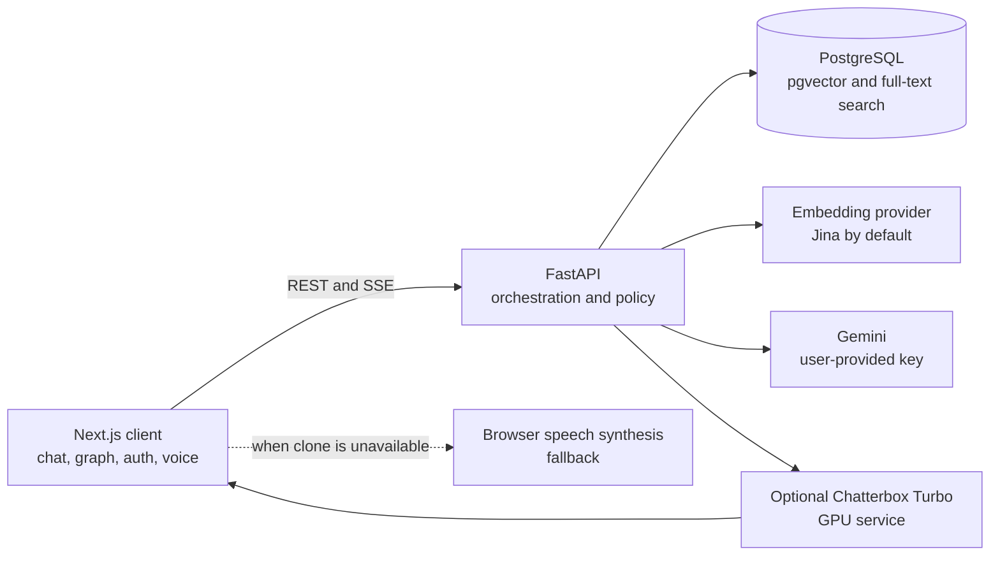
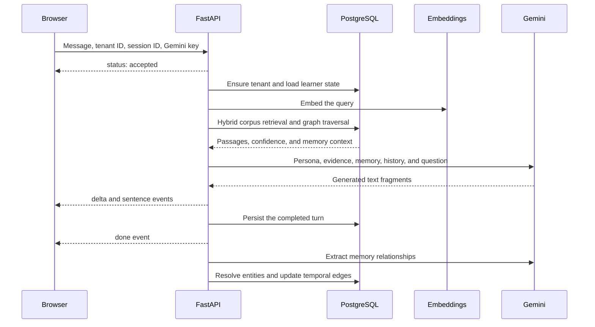
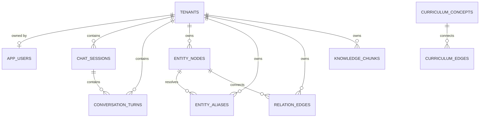

# Technical Architecture

This document describes the current application architecture. For installation
and operator-facing configuration, start with the root
[`README.md`](README.md).

## System boundaries

The production deployment uses Vercel for the frontend, Render for the API,
and Neon for PostgreSQL. The cloned voice is optional because the current
Kaggle GPU service is temporary. Text chat and browser speech remain available
when it is offline.

## Request lifecycle

The main conversational route is `POST /api/v1/chat/stream`.

The stream starts with a status event before retrieval. While retrieval or
generation is slow, the API emits heartbeat events. Completed sentence events
let voice synthesis begin before the full answer has finished.

## Retrieval

Retrieval lives in `backend/app/services/retrieval.py` and the PostgreSQL
functions defined by the migrations.

1. Follow-up questions can be rewritten into standalone queries.
2. The configured provider embeds the query. The deployed corpus uses Jina
   `jina-embeddings-v3` with 1024-dimensional vectors.
3. `hybrid_chunk_retrieval` runs pgvector cosine search and PostgreSQL
   full-text search.
4. Reciprocal Rank Fusion combines both ranked lists. The default weights are
   0.65 for vector retrieval and 0.35 for full-text retrieval.
5. Adjacent chunks from the same source are merged into passages so definitions
   and worked examples are not separated at chunk boundaries.
6. The best cosine score is compared with `RETRIEVAL_MIN_COSINE`. Weak matches
   are labelled as such instead of being presented as strong grounding.
7. When the curriculum graph identifies missing prerequisites, a small amount
   of prerequisite material is retrieved alongside the direct answer.

Shared corpus chunks are visible to every tenant. Private chunks, if enabled
later, remain visible only to their owner.

## Contextual memory

The memory graph records learner-specific context, not the source corpus.
Typical relations include concepts a learner has discussed, mastered, or
struggled with.

Before generation, `vector_anchored_subgraph` selects relevant entity nodes and
traverses nearby active relations. The resulting summary is added to the
prompt together with an explicit learner profile.

After generation, the triplet extractor:

1. extracts candidate subject, predicate, and object relationships;
2. rejects instruction-shaped or unsupported evidence;
3. resolves aliases before creating a new entity;
4. invalidates contradictory live relations when the learner's state changes;
5. records observation counts and temporal validity;
6. marks each conversation turn as processed, skipped, or failed.

Extraction runs after the response is persisted. The next request also sweeps
eligible unprocessed turns, so a process restart does not silently lose memory
updates.

## Identity and isolation

A guest receives a random tenant UUID stored in browser local storage. That
identifier is reused across refreshes rather than regenerated on every page
load.

An authenticated account owns one tenant. Auth.js stores the tenant ID in its
JWT session, allowing the same chat and memory graph to follow the user across
devices. When a guest signs up, the account can adopt the existing guest
tenant.

Every history, graph, deletion, and generation request carries
`X-Tenant-Id`. Database queries scope user-owned data by that identifier.
`POST /api/v1/chat/clear` removes the tenant's sessions, turns, entities,
aliases, and relationships while retaining the identity itself.

## Generation and persona enforcement

The browser sends the user's Gemini key in `X-Gemini-Api-Key`. Production mode
does not fall back to a server-owned key. The backend creates model clients per
request so one visitor's key cannot leak into another visitor's call.

The generation pipeline combines:

- the maintained persona instruction;
- the current turn type;
- retrieved evidence and grounding strength;
- graph-derived learner context;
- account context;
- recent conversation history.

Turn routing distinguishes greetings, follow-ups, opinions, and concept
explanations so short interactions do not pay the latency or token cost of a
full teaching response.

The persona source of truth is
`backend/app/services/persona.py`. Mechanical rules such as banned openers,
rendered teaching scaffolds, and unfinished sentences are validated after
generation. Deterministic repairs are applied only when the intended edit is
unambiguous.

## Persistence model

| Table | Responsibility |
|---|---|
| `tenants` | Root isolation boundary for guest and account data |
| `app_users` | Account credentials and tenant ownership |
| `chat_sessions` | Session titles and activity timestamps |
| `conversation_turns` | Persisted user and assistant messages plus extraction state |
| `knowledge_chunks` | Shared or private corpus passages, embeddings, and search metadata |
| `entity_nodes` | Canonical learner-memory entities |
| `entity_aliases` | Alternate names mapped to canonical entities |
| `relation_edges` | Weighted, temporal relationships with supporting evidence |
| `curriculum_concepts` | Shared learning concepts |
| `curriculum_edges` | Prerequisite relationships between curriculum concepts |
| `schema_migrations` | Applied migration names and checksums |

The vector columns use 1024 dimensions in the current schema. Ingestion and
request-time retrieval must use the same provider, model, and dimensions.

## Voice path

Voice mode has three independent layers:

1. Browser speech recognition converts microphone input to text.
2. The normal SSE pipeline produces the answer and emits completed sentences.
3. The backend sends each sentence to the configured Chatterbox endpoint.

The backend caches TTS reachability briefly, limits concurrent synthesis, caps
text length, and reports upstream timing. If the cloned service is unavailable
or busy, the frontend switches to a stable browser voice instead of stalling
the conversation.

The maintained GPU implementation is
`notebooks/kaggle_tts_server.py` and its notebook equivalent. It is intended
for private demonstrations, not dependable production hosting.

## Operational constraints

- Embedding-model changes require a full corpus re-embedding. Vector dimensions
  cannot be converted between unrelated embedding spaces.
- Migration `014_voyage_embeddings_1024.sql` deletes existing corpus chunks
  before changing vector width. Check migration status before operating on an
  established database.
- In-process rate limits protect cost and fairness on one API replica. A
  multi-replica deployment would need a shared rate-limit store.
- Prompt caches are held in API memory. Multiple replicas do not share them.
- Background extraction is recoverable through the unprocessed-turn sweep, but
  it is not a general-purpose distributed job queue.
- Kaggle and tunnel-backed voice endpoints can disappear at any time. Browser
  speech is the supported availability fallback.
