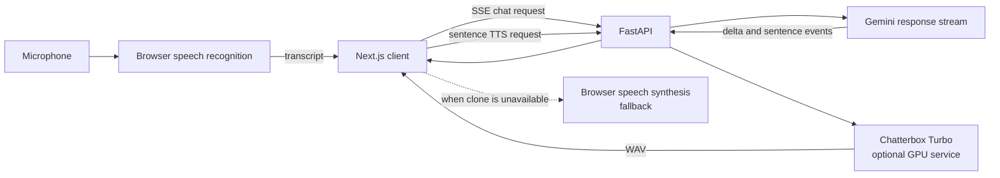

# Voice Setup

The application supports hands-free input, cloned speech when a GPU service is
available, and browser speech when it is not.

> [!IMPORTANT]
> The Chatterbox clone is intended for a private demonstration. It uses a
> synthetic recreation of a living person's voice. Keep the disclosure and
> watermarking enabled, use a reference sample you have the right to process,
> and do not present generated audio as a real recording.

## Voice architecture



The browser never waits for the complete answer before starting speech.
Completed sentence events are synthesized while later text is still being
generated.

## Browser-only voice

No GPU is required for the supported fallback.

1. Leave `CHATTERBOX_URL` unset or point it at an unavailable endpoint.
2. Start the frontend and backend normally.
3. Open the application in Chrome or Edge over HTTPS or `localhost`.
4. Allow microphone access when entering interactive voice mode.

The browser converts speech to text through its speech-recognition provider.
When cloned speech is unavailable, the frontend uses a pinned browser voice so
the provider does not change between sentences.

Browser speech quality and recognition support vary by operating system and
browser. Firefox does not currently provide the same
`webkitSpeechRecognition` interface used by this application.

## Private cloned-voice demo on Kaggle

The maintained server is:

- `notebooks/kaggle_tts_server.ipynb`
- `notebooks/kaggle_tts_server.py`

Both load Chatterbox Turbo, condition the reference voice once, expose an
OpenAI-compatible speech endpoint, and report watermarking state through
`/health`.

### 1. Prepare the reference sample

`backend/data/andrew_ng_ref.wav` is intentionally excluded from Git.

A useful conditioning sample is:

- 10 to 30 seconds long;
- one speaker only;
- free of music, overlap, echo, and heavy compression;
- recorded at a natural speaking pace;
- stored as WAV.

Upload the sample to a private Kaggle dataset. Do not make a biometric voice
sample public merely to simplify notebook setup.

### 2. Configure Kaggle

1. Create or open a Kaggle notebook.
2. Enable a GPU accelerator.
3. Enable internet access so the public tunnel can start.
4. Attach the private dataset containing `andrew_ng_ref.wav`.
5. Import `notebooks/kaggle_tts_server.ipynb`, or paste the Python notebook
   script into a cell.
6. Run all cells.

Listen to the generated test clip before connecting the application. A clean
reference sample matters more than frontend playback tuning.

The final cell prints values similar to:

```text
CHATTERBOX_URL=https://random-name.trycloudflare.com/v1/audio/speech
```

The `trycloudflare.com` address changes whenever the quick tunnel restarts.
Kaggle sessions and Cloudflare Quick Tunnels are temporary development tools,
not production hosting.

### 3. Connect the backend

For local development, add the printed endpoint to `.env`:

```dotenv
CHATTERBOX_URL=https://random-name.trycloudflare.com/v1/audio/speech
```

For the deployed backend, set the same variable in Render and restart or
redeploy the service.

Verify the GPU server directly:

```bash
curl https://random-name.trycloudflare.com/health
```

Expected fields include:

```json
{
  "status": "ok",
  "device": "cuda",
  "watermarking": true,
  "voice": "andrew_ng_ref",
  "model": "chatterbox-turbo"
}
```

Then verify the application chain:

```bash
python scripts/smoke_test.py
```

## What happens when the GPU stops

The backend exposes `GET /api/v1/chat/tts/status`. The frontend checks this
before playback and can refresh it after a failure.

If Chatterbox is unavailable, times out, or is busy:

1. the current synthesis request fails quickly;
2. the frontend selects the browser voice;
3. queued and future sentences continue through the fallback;
4. the text conversation remains unaffected.

Restarting the Kaggle notebook restores cloned speech after the new tunnel URL
is copied to `CHATTERBOX_URL`.

## Optional ngrok development domain

ngrok can remove the need to change the backend environment variable after
every notebook restart. It supplies a public HTTPS tunnel to port 5002, just as
the current Cloudflare command does.

ngrok does not keep Kaggle alive, provide a GPU, or turn the notebook into
production hosting. The free plan supplies an account-assigned development
domain. Do not hardcode an auth token or assume a custom free domain can be
chosen.

Store `NGROK_AUTHTOKEN` in Kaggle Secrets, then use a notebook cell similar to:

```python
!pip install -q pyngrok

from kaggle_secrets import UserSecretsClient
from pyngrok import ngrok

token = UserSecretsClient().get_secret("NGROK_AUTHTOKEN")
ngrok.set_auth_token(token)
tunnel = ngrok.connect(5002, "http")
print(tunnel.public_url)
```

Confirm that the printed hostname is the development domain assigned to the
ngrok account before saving it in Render.

## Troubleshooting

| Symptom | Likely cause | Action |
|---|---|---|
| Tunnel command cannot connect | Kaggle internet access is disabled | Enable internet and rerun the tunnel cell |
| `/health` reports `cpu` | GPU accelerator is not active | Enable the accelerator and restart the session |
| Reference audio is not found | Private dataset is not attached or filename differs | Attach the dataset and inspect the paths printed by the notebook |
| Test clip sounds unlike the reference | Noisy, short, or multi-speaker sample | Replace it with clean single-speaker audio |
| `address already in use` on port 5002 | The server from an earlier cell is still running | Reuse the existing server or restart the Kaggle session before relaunching |
| Browser uses generic speech | Chatterbox health check failed | Check the tunnel, Kaggle session, and Render `CHATTERBOX_URL` |
| Microphone does nothing | Permission, browser, or secure-origin issue | Use Chrome or Edge over HTTPS or localhost and allow the microphone |
| No audio plays | Autoplay was blocked | Interact with the page once, then retry |
| First cloned sentence is slow | Model or GPU is warming | Send one short warm-up request before a demo |
| Sentences have gaps | Synthesis is slower than playback | Keep answers concise or use an always-warm GPU service |

## Production decision

Kaggle plus a public tunnel is appropriate for a private demo only. A
production service needs a stable GPU endpoint, authentication, rate limits,
monitoring, and clear rights to the selected voice.

For a public deployment, use one of these designs:

1. Browser speech only, with no cloned voice infrastructure.
2. A licensed hosted voice through an adapter matching the current TTS
   request contract.
3. An authenticated GPU service you operate, using a voice you are permitted
   to deploy.

See [`POSTURE.md`](POSTURE.md) for the project's public-use boundaries.
